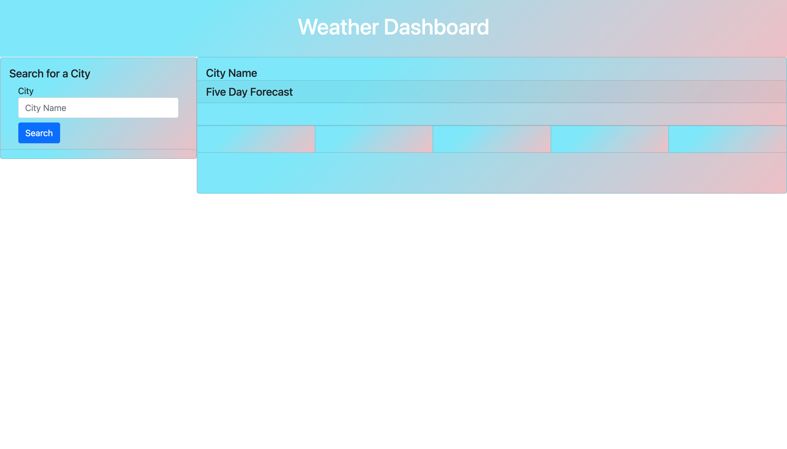
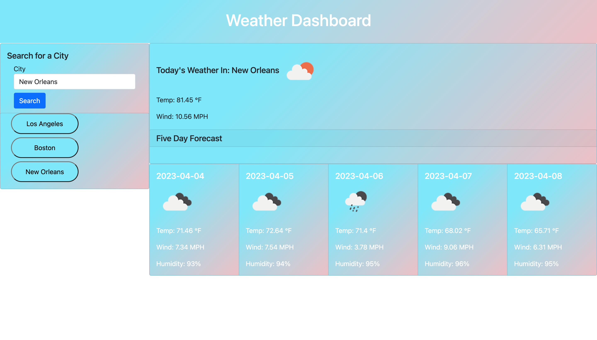

# weather-forecast-app

## Description

My motivation constructing this project was to create a weather dashboard that displays current and future weather conditions for multiple cities in order for a traveller to plan their trip accordingly. I built this project to provide the weather forecast for multiple days so the user can be prepared for the weather in any city they choose to search. Moreover, I built this project to allow the user to view previously searched cities and gather weather information on those cities again if they so choose. This project solves the problem of quickly accessing the current or future weather conditions for any city an individual chooses, as well as the issue of the user having the ability to plan their trip according to the weather in the city they wish to travel to. In this project, I learned how to use server-side APIs, specifically utilizing the Open Weather API, to collect a wide range of data to be accessed by my site. I also learned how to apply Bootstrap CSS styling to my site to create an aesthically pleasing user experience. Lastly, this site uses local storage to store the user's previously searched cities and render them on the page.

## Usage

To use this application, you simply type a city into the "Search for a City" input box as seen in the first image. Once typing in the city whose weather you wish to view, you click on the "Search" button and the current weather as well as a 5-day forecast is rendered on the page. Moreover, each city you search will appear as buttons under the search area of the page as seen in the second image. If you wish to see the weather and forecast of a previously searched city, simply click the button with the city name and that city's weather will be rendered on the page. The site utilizes local storage to save your input and render it on the page again.

## Credits

This project uses the Open Weather API database to gather weather data. Here is a link to their site: https://openweathermap.org/api .

## How to Contribute

If you would like to contribute to this project, please reach out to me via email at kendrajfitzgerald@gmail.com . I would love any collaboration that could help improve my project.